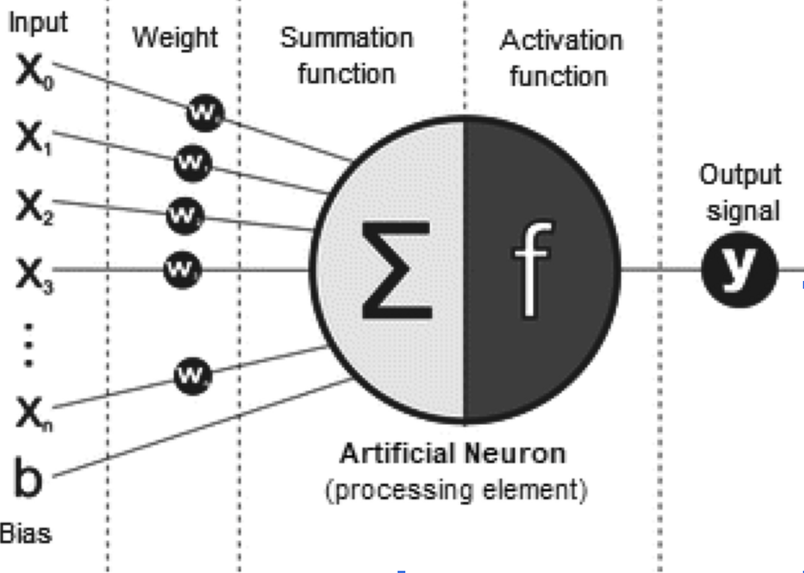
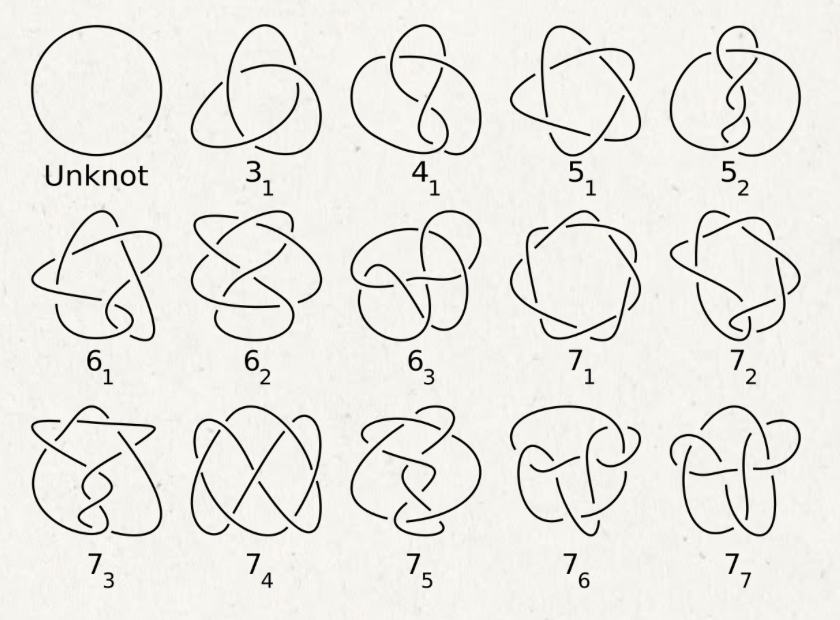
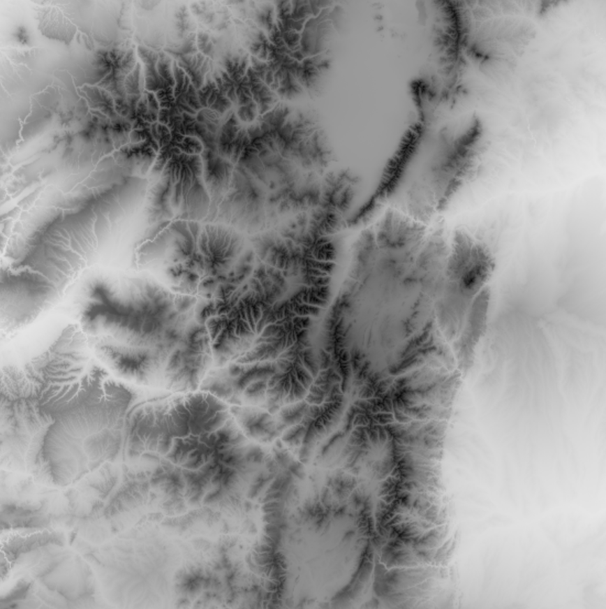
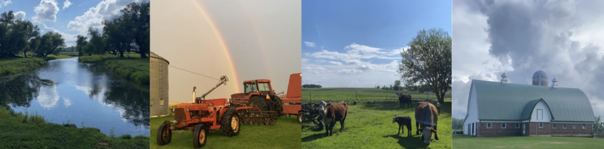

# Welcome! My name is Joey Fischer! Here is a little about me.

🎓 [Education](#education)  
💼 [Work Experience](#experience)  
📊 [Projects](#projects)  
🏅 [Certifications](#certifications)  
🛠️ [Skills](#skills)  
🏆 [Activities & Involvements](#activities)  
🚜 [Personal Passions](#personal)  
🔗 [Contact and Additional Information](#contact)

## 🎓 Education  
### University of Denver - Denver, Colorado  
**Magna Cum Laude Bachelor of Science - Mathematics**  
*Minor: Business Analytics/Statistics*  
- **GPA**: 3.91 
- **Graduation**: June 2025  

**Honors & Achievements:**  
- Dean’s List  
- Hornbeck Scholar’s List  

[⬆ Back to Top](#top)

---

## 💼 Work Experience  

###  | Heico Companies LLC - Warrenville, Illinois 
**Corporate IT Intern** *(June - August 2023)*  
- Used **data analytics** to generate reports for business decisions via **Power BI**  
- Integrated **AI automation** into company processes using **Power Automate**  
- Developed a **PTO tracking system** for managers using **Power Apps**

###  | Hiiguru Inc. - London, United Kingdom  
**Intern** *(September - December 2023)*  
- Led the **implementation of AI** in company’s social media strategies  
- Conducted **market research** for both B2B and B2C applications  
- Cleaned and analyzed **business data** to create actionable reports  

###  | University of Denver - Math Department - Denver, Colorado  
**Academic Tutor** *(January 2024 - Present)*  
- Tutor for **all levels of Calculus** at the Anderson Academic Commons  
- Work collaboratively with fellow tutors to ensure student success  

[⬆ Back to Top](#top)

---

## 📊 Projects

### Undergraduate Research

**[Honors Thesis](https://github.com/joeywfischer/joeyfischer.github.io/blob/main/undergradresearch/Efficacy%20of%20Artificial%20Intelligence%20Models%20in%20Advanced%20Mathematics.pptx): “Efficacy of Artificial Intelligence in Advanced Mathematics”**  
- University-sponsored undergraduate research into AI's effectiveness in solving advanced mathematical problems  
- Investigated AI models' accuracy and challenges in mathematical reasoning  
- Gained insights into AI model training and development

  

**Independent [Knots and Quandles](https://github.com/joeywfischer/joeyfischer.github.io/blob/main/undergradresearch/Quandles%20and%20Knots.pptx) Study**
- Researched mathematical theory of Knots and Quandles
- Proved the uniqueness of the first seven prime knots
- Presented on study to the University of Denver math department

  

### Python Samples 

**[Map of Colorado Elevation](https://github.com/joeywfischer/joeyfischer.github.io/tree/main/python/COelevation)**
- Created a grayscale gradient map of Colorado elevations using the University of Denver's DUdraw library

  

**[Opitcal Illusion](https://github.com/joeywfischer/joeyfischer.github.io/blob/main/python/JoeyFischer.OpticalIllusion.py)** 
- Coded an opitcal illusion using the University of Denver's DUdraw library

  

[⬆ Back to Top](#top)

---

## 🏅 Certifications  

| Certification | Provider |
|--------------|----------|
| **PCEP: Python Beginner** | Python Institute |
| **PCAP: Python Intermediate** | Python Institute |
| **Microsoft Excel Expert** | Microsoft |
| **Microsoft PowerPoint Associate** | Microsoft |
| **Microsoft Word Expert** | Microsoft |

[⬆ Back to Top](#top)

---

## 🛠️ Skills

### Hard Skills
- **Python**: *PCEP: Beginner* | *PCAP: Intermediate*  
- **Microsoft Office**: *Certified in Excel, PowerPoint, and Word*  
- **Power Platforms**: *Proficient in Power BI, Power Apps, Power Automate*  
- **Mathematical & Statistical Analysis**: Passion for data-driven decision-making  
- **Artificial Intelligence**: Active research and interest in AI advancements and applications  

### Soft Skills
- **Collaboration**: work together with fellow Calculus tutors to help students
- **Problem-Sovler**: analytical and mathematical mind that finds logical solutions to problems
- **Adaptability**: lived and adapted in diverse locations: rural Minnesotan farm, Denver, downtown Chicago, New Hampshire, London

[⬆ Back to Top](#top)

---

## 🏆 Activities & Involvements  

**Presenter at 22nd Annual Pikes Peak Undergraduate Math Conference**
- Presented undergraduate honors thesis: “Efficacy of Artificial Intelligence in Advanced Mathematics”

**Undergraduate Involvements**
- **Member of Math Club** - University of Denver *(2021 - Present)*  
- **Member of DU Jet Engine Team** *(2023 - Present)*

[⬆ Back to Top](#top)

---

## 🚜 Personal Passions

- **Agrilculture**: Raised as the 5th generation on my family's farm in rural Minnesota hoping to oneday connect my skills to improving conditions for U.S. farmers.
- **Animal lover**: I've had pet cats, dogs, cows, chickens, pigs, rabbits, fish, geese, ducks, sheep, pheasants, and a hamster.
- **Video Games**: I love tactical RPGs where I can use my mathematics skills to compute odds/probability and build a strategy.
- **Numbers**: Always been fascinated with numbers, statistics, and mathematics.

  

[⬆ Back to Top](#top)

---

## 🔗 Contact and Additional Information

If you share any interests or want to connect feel free to reach out to my [LinkedIn](https://www.linkedin.com/in/j-w-fischer/ )!

Feel free to read my [resume and letters of recommendation from former employers](https://github.com/joeywfischer/joeyfischer.github.io/tree/main/resources)!  

[⬆ Back to Top](#top)

